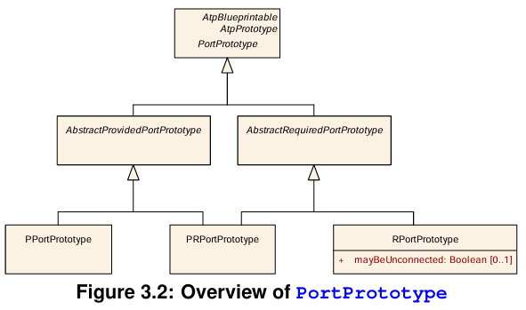
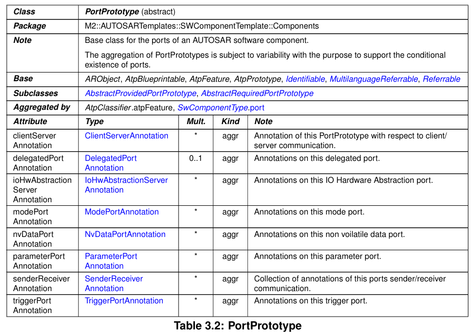
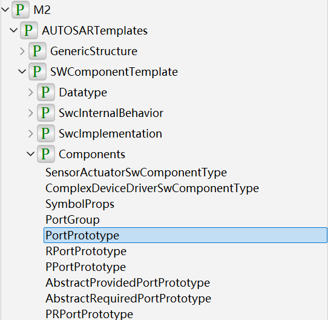
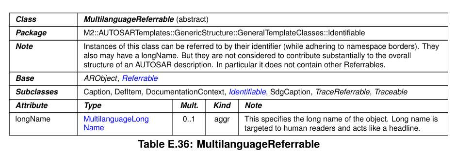

# AUTOSAR Model Encapsulation Guide

This document describes how AUTOSAR-compliant software component models are encapsulated using the Modelica language within this library. It outlines key concepts, encapsulation techniques, inheritance considerations, and best practices for structuring AUTOSAR elements in a Modelica-based simulation environment.

## 1. Overview

- The goal is to provide a Modelica model library that adheres to AUTOSAR standards.
- This library supports constructing and encapsulating AUTOSAR models in a Modelica environment.
- Integration scenarios include simulation, co-simulation, and system-level testing.

## 2. Encapsulation Case Study

This section presents a detailed encapsulation case based on AUTOSAR Application Layer elements, as specified in the [AUTOSAR Software Component Template Specification (R24-11)](https://www.autosar.org/fileadmin/standards/R24-11/CP/AUTOSAR_CP_TPS_SoftwareComponentTemplate.pdf).

> About this document:  
> *This document contains the specification of the AUTOSAR Software Component Template. It complements the formal definition provided by the AUTOSAR meta-model and offers an introductory explanation and rationale for software component elements.*

### Example: Encapsulating `RPortPrototype`

We aim to encapsulate an AUTOSAR **Required Port (RPortPrototype)**. According to the meta-model diagram below:



- `RPortPrototype` inherits from `AbstractRequiredPortPrototype`
- `AbstractRequiredPortPrototype` inherits from `PortPrototype`

Hence, we follow this inheritance structure in our Modelica library. The official tabular specification of `PortPrototype` is shown below:



As indicated in the figure, `PortPrototype` resides in the package:  
`M2:AUTOSARTemplates::SWComponentTemplate::Components`.

Therefore, in our Modelica library, we place the definition of `PortPrototype` in the corresponding package path:



### Handling Inheritance

In AUTOSAR, meta-model classes like `PortPrototype` have multiple base classes, such as:

- `ARObject`
- `AtpBlueprintable`
- `AtpFeature`
- `AtpPrototype`
- `Identifiable`
- `MultilanguageReferrable`
- `Referrable`

This reflects **multiple inheritance**. However, since Modelica only supports **single inheritance**, we analyze the inheritance chain and identify that these base classes themselves have internal hierarchical relationships.

For instance, the `MultilanguageReferrable` class is defined as follows in the AUTOSAR meta-model:



Hence, in Modelica, we only need to inherit from the most specific base class. In this case:

```modelica
extends M2.AUTOSARTemplates.GenericStructure.GeneralTemplateClasses.Identifiable.MultilanguageReferrable;
```

This inheritance approach is sufficient to capture all required behaviors and attributes defined by the AUTOSAR meta-model.

### Visual Modeling Support

Since Modelica emphasizes visual modeling, we explicitly encapsulate AUTOSAR elements that require graphical instantiation.

For example, `VisibleElements.RPORT` inherits from `M2.AUTOSARTemplates.SWComponentTemplate.Components.RPortPrototype`, thereby gaining the semantic properties defined by the AUTOSAR specification. Simulation-specific behavior can then be added directly within these visual elements to enable executable application-layer modeling.

By separating abstract model definitions from their visual counterparts, we ensure better **extensibility**, **reusability**, and **compliance** with AUTOSAR structural standards.

## 3. Known Issues and Future Improvements

The AUTOSAR standard is vast—spanning tens of thousands of pages—and it is currently impractical for a small team to fully cover every component and feature.

Nevertheless, this repository demonstrates the **feasibility of encapsulating AUTOSAR-compliant elements using Modelica**.

Planned improvements include:

- Encapsulating additional AUTOSAR elements  
- Supporting more complex simulation behaviors  
- Enhancing visual modeling capabilities for sophisticated SWC scenarios
