# Example Models Overview

This document provides detailed descriptions and key information for the 10 example models included in the `Examples` folder.

---

> 📘 **Application Note**  
> The [Automotive Throttle Control System](#2-automotive-throttle-control-system) is the **largest-scale example**, featuring **179 variables** and **451 parameters**.  
> It fully demonstrates hierarchical conversion and advanced signal handling across subsystems.

## Simulation Time Comparison

Below is a comparison table showing the simulation times for the three example cases in Modelica (1st and 2nd simulations) and Simulink.  

> ⚠️ **Note**  
> Some Simulink blocks (e.g., `From` / `Goto`) do not have direct counterparts in Modelica.  
> However, the functional behavior remains equivalent, and the simulation results are consistent.  
> Also, system-level port names do not need to exactly match subcomponent port names — e.g., `a.u1` can correspond to `a.b.u`.

| Example Case                | Modelica Simulation Time (1st) | Modelica Simulation Time (2nd and more) | Simulink Simulation Time |
|----------------------------|-------------------------------|-------------------------------|--------------------------|
| Swc_Expfcns_Example        | 5.9494 s                      | 0.0013 s                      | 0.4157 s                 |
| Automotive Throttle Control System  | 7.2132 s                      | 0.057 s                       | 1.4702 s                 |
| autosar_swc_Example         | 4.2066 s                      | 0.0010 s                      | 0.6646 s                 |

---

## Simulink Comparable Cases (3)

### 1. Swc_Expfcns_Example
- **Description**:  
  This example, directly comparable to the Simulink official example, models an AUTOSAR application layer software component (SWC) with three RPorts: RPort E (error validation, set to 0 meaning no errors), RPort 1 (gain control with a 1-second sampling period, gain set to 0), and RPort 2 (attenuation factor with a 10-second sampling period, set to 0). The SWC has four PPorts outputting periodic signals at different intervals. The system includes three runnables with sample times of 1 and 10 seconds communicating via Inter-Runnable Variables (IRV).

- **Performance**:  
  Modelica first simulation: ~5.9494s  
  Modelica parameter-only re-simulation: ~0.0013s  
  Simulink simulation: ~0.4157s

- **Location**: `M2/Examples/Swc_Expfcns`  
- **Simulink Official Example**: [Link](https://ww2.mathworks.cn/help/autosar/ug/example-model-autosar-runnables-exported.html)

- **Modelica**  
  Model structure:  
  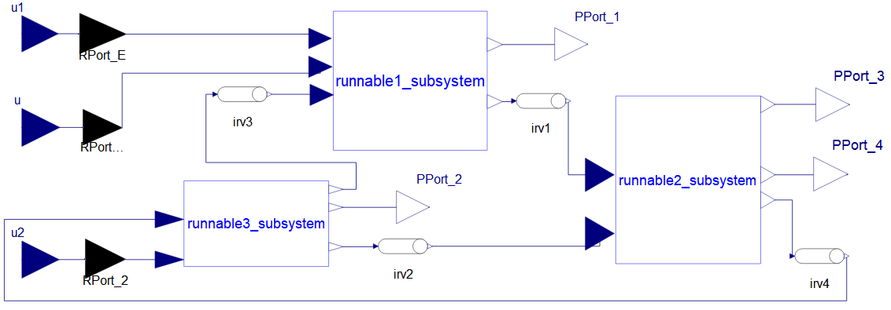  
  Simulation results:  
  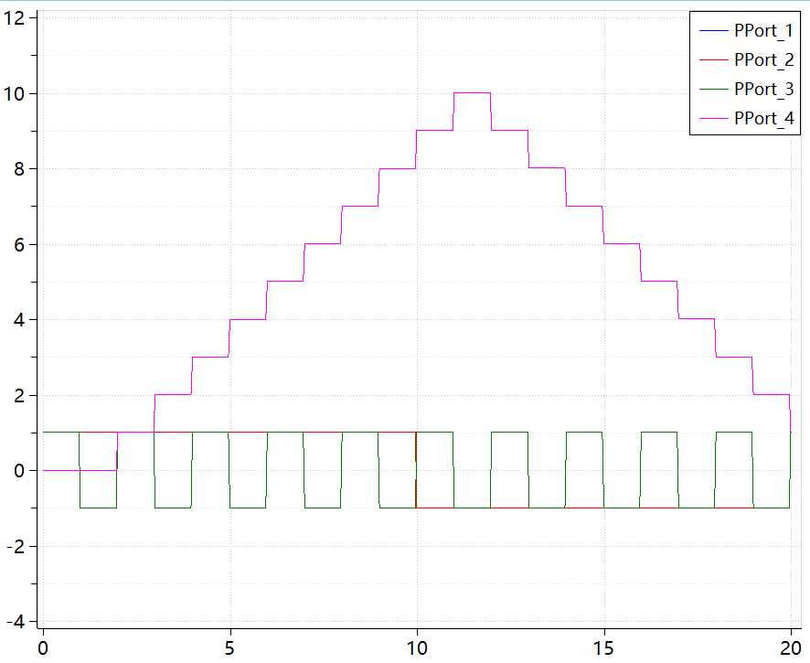

- **Simulink**  
  Model structure:  
  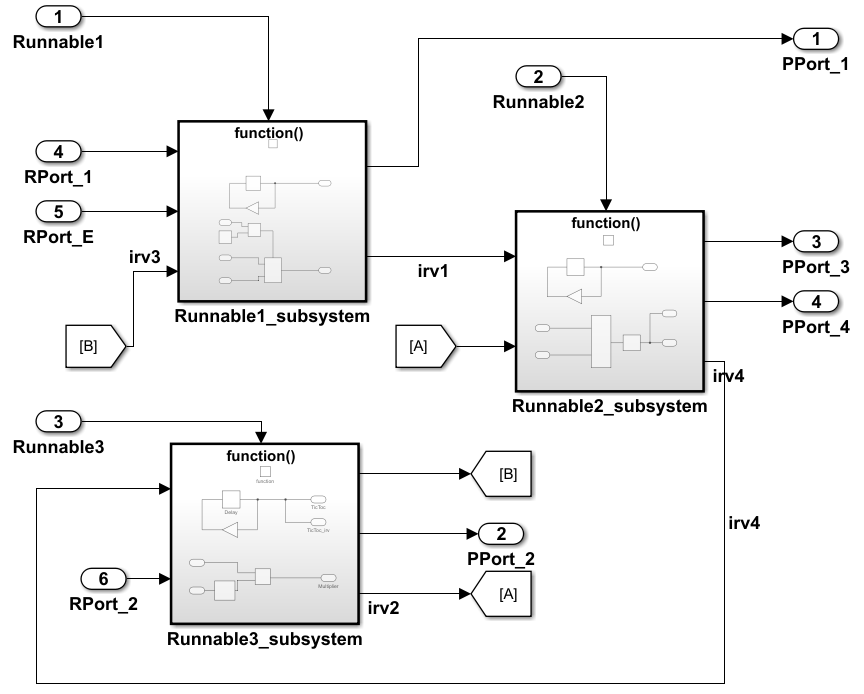  
  Simulation results:  
  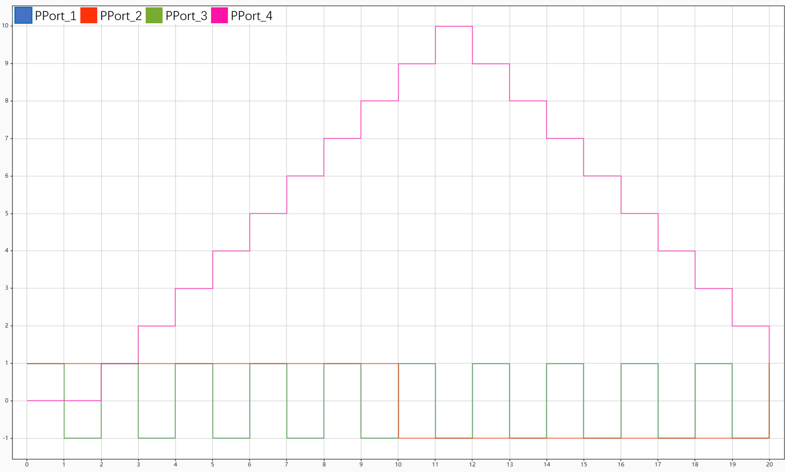

---

### 2. Automotive Throttle Control System (AUTOSAR)
- **Description**:  
  The `autosar_composition` module models an AUTOSAR-based Automotive Throttle Control System (Throttle-by-Wire) following AUTOSAR architecture principles. It consists of multiple software components (SWCs) such as:

  - TPS_Secondary and TPS_Primary: Two throttle position sensors that normalize hardware inputs.  
  - Monitor: Safety monitoring module for TPS values.  
  - APPSnsr: Accelerator pedal position sensor converting pedal input to a percentage.  
  - Controller: Main controller generating throttle commands based on sensor inputs.  
  - Actuator: Converts commands into hardware control signals.  
  - ThrCmd_HwIO_Value: Output interface representing the final throttle hardware signal.

- **Performance**:  
  Modelica first simulation: ~7.2132s  
  Modelica parameter-only re-simulation: ~0.057s  
  Simulink simulation: ~1.4702s

- **Location**: `M2/Examples/autoar_composition`  
- **Simulink Official Example**: [Link](https://ww2.mathworks.cn/help/autosar/ug/example-modeling-patterns-for-autosar-runnables.html)

- **Modelica**  
  Model structure:  
  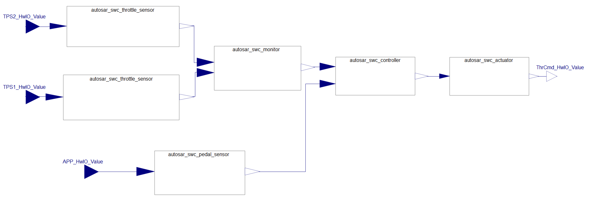  
  Simulation results:  
  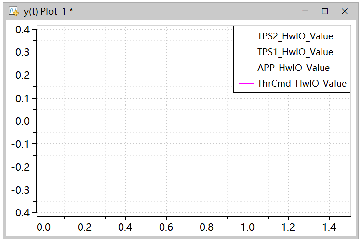

- **Simulink**  
  Model structure:  
  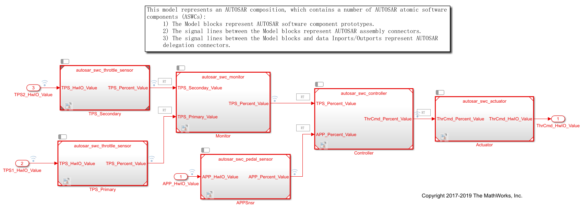  
  Simulation results:  
  

---

### 3. autosar_swc_Example
- **Description**:  
  Demonstrates an AUTOSAR atomic software component (ASWC) with two periodic runnables (`Runnable_1s` and `Runnable_2s`) running at 1-second and 2-second intervals, respectively. The model supports multitasking for efficient execution. It includes an initialization function that sets an integrator initial value.

- **Performance**:  
  Modelica first simulation: ~4.2066s  
  Modelica parameter-only re-simulation: ~0.0010s  
  Simulink simulation: ~0.6646s

- **Location**: `M2/Examples/autosar_swc_Example`  
- **Simulink Official Example**: [Link](https://ww2.mathworks.cn/help/autosar/ug/example-modeling-patterns-for-autosar-runnables.html)

- **Modelica**  
  Model structure:  
  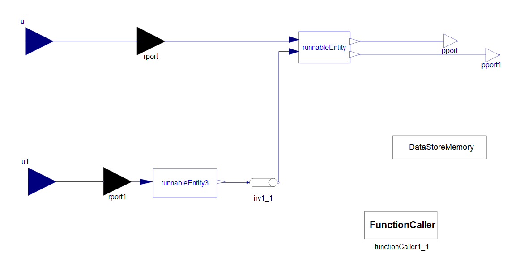  
  Simulation results:  
  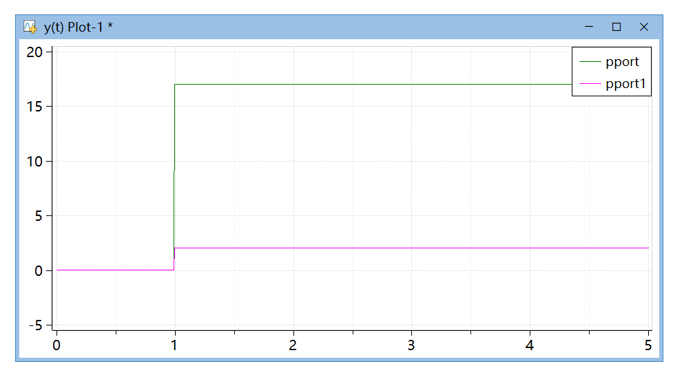

- **Simulink**  
  Model structure:  
  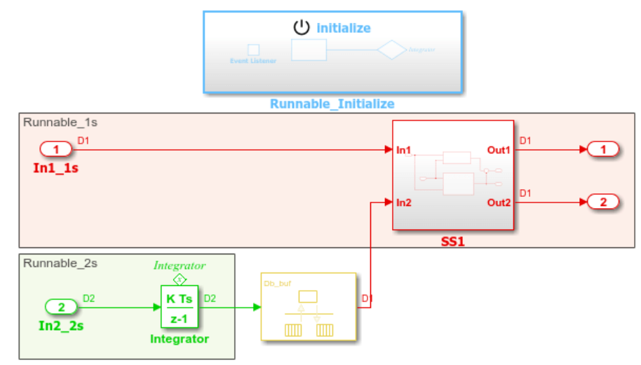  
  Simulation results:  
  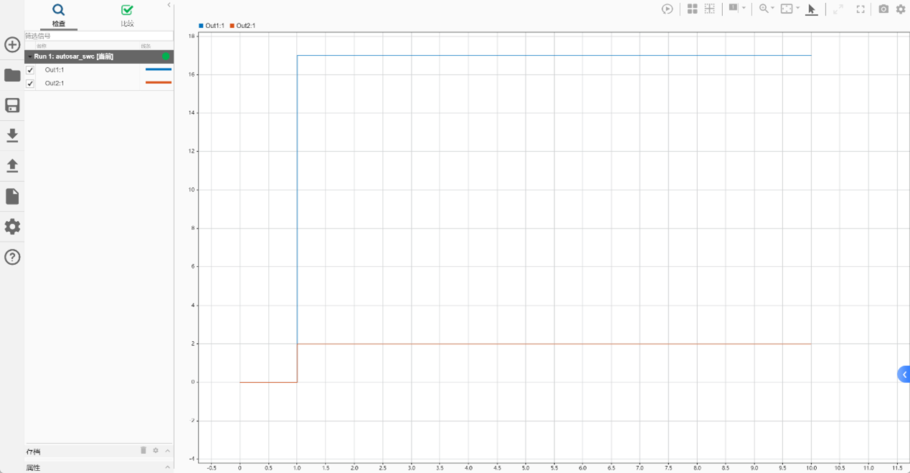

---

## Multi-domain Demonstration Cases (7)

1. Multi-Domain Modeling of Swc_Expfcns and Headlamp
- **Description**: All three RPort inputs are set to 0. PPort 1 and PPort 3 are connected to the switch states of "headlamp left" and "headlamp right," respectively, indicating whether the headlights are ON or OFF. PPort 4 represents the applied voltage and is linked to both "headlamp left" and "headlamp right" to simulate the electrical behavior of the lighting system.
 The HeadLamp model has two input ports: switch, controlling the ON/OFF state, and voltageInput, representing the applied voltage. The model calculates the voltage based on the switch state, then uses Ohm’s law to determine the current. Power is computed as the product of voltage and current. Brightness is derived by normalizing the power against its maximum value, ensuring it remains within [0,1].

- **Location**: `M2/Examples/AUTOSAR_HeadLamp`  

- **Modelica**  
  Model structure:  
  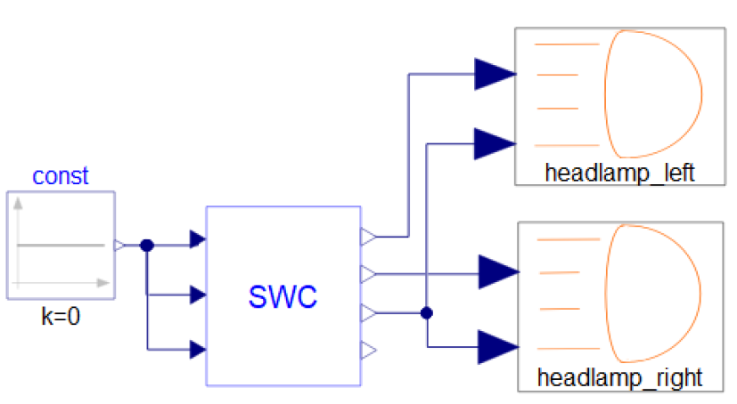  
  Simulation results:  
  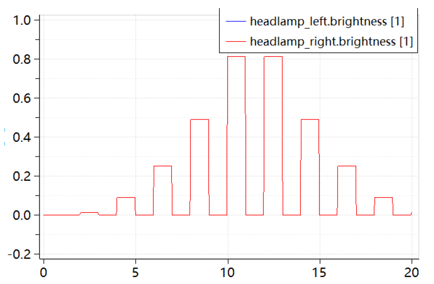

### 2. Automotive Throttle Control System

- **Description**:  
A complex throttle control system with 179 variables and 451 parameters.

The Modelica model autosar_system is built on AUTOSAR architecture principles to simulate an electronic throttle system, covering the full process from driver pedal input to throttle opening response. It integrates multiple functional modules including mechanical pedal response, signal acquisition and conversion, ECU signal processing logic, and final actuator control, fully replicating the electronic throttle operation.

The physical start point is the ThrottlePedalMechanical module. It simulates the driver’s foot force as a periodic signal (footForceSignal) and contains mechanical elements such as springs, dampers, and masses to realistically model the pedal displacement under external force. The output is the pedal's mechanical displacement, reflecting the driver’s pedal depth.

This displacement is converted to an analog voltage signal by the PedalPositionToADC module, simulating the ADC acquisition in a real vehicle. The converted signal feeds into the AUTOSAR software component composition autosar_composition through interface APP_HwIO_Value. Within it, the APP_Snsr component processes the signal and generates the throttle command ThrCmd_HwIO_Value.

The throttle command passes through a normalization gain block (gain = 1/2048) and is sent to the ThrottleBody module, which drives the throttle actuator and adjusts the throttle opening.

The actual throttle opening is fed back via ConvertTPStoADCRange to produce two ADC outputs (TPS1 and TPS2), simulating redundant throttle position sensors. These signals are inputs to TPS_Primary and TPS_Secondary software components in autosar_composition, simulating ECU’s real-time throttle position monitoring and forming a closed-loop control system.

autosar_composition is the core control module integrating the pedal sensor unit (APP_Snsr), actuator control unit (Actuator), and dual throttle position feedback units (TPS_Primary and TPS_Secondary). The components connect via standard signal ports, following typical AUTOSAR software component communication patterns. Each component encapsulates specific logic such as lookup tables and control algorithms, mimicking embedded software behavior.

The model design decouples physical and control modeling: mechanical structures describe dynamic pedal and throttle responses, while AUTOSAR software components modularly organize control logic, supporting signal acquisition, data processing, and execution control. This enables controller design verification, embedded software function testing, and multi-domain co-simulation.

Simulation assumes a 60N force applied to the pedal over 0–1 seconds. The pedal displacement, converted into voltage, is processed by the AUTOSAR controller to generate throttle commands that control throttle actuator motion. Throttle displacement feedback closes the loop. Results show a maximum pedal displacement of about 15 cm under 60N load. Throttle opening closely follows pedal input dynamics, validating the model's accuracy.

- **Location**: `M2/Examples/throttle_control_Example`  

- **Modelica**  
  Model structure:  
  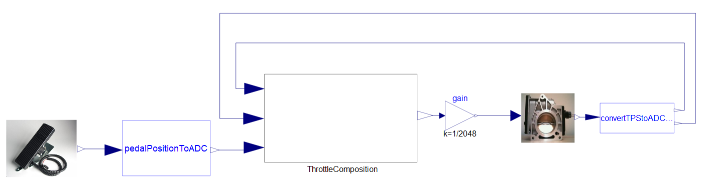  
  ThrottlePedalMechanical:
  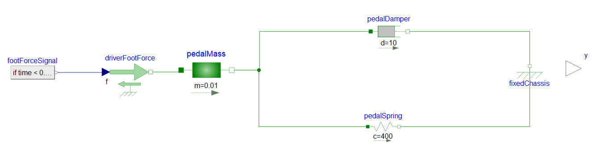
  Simulation results:  
  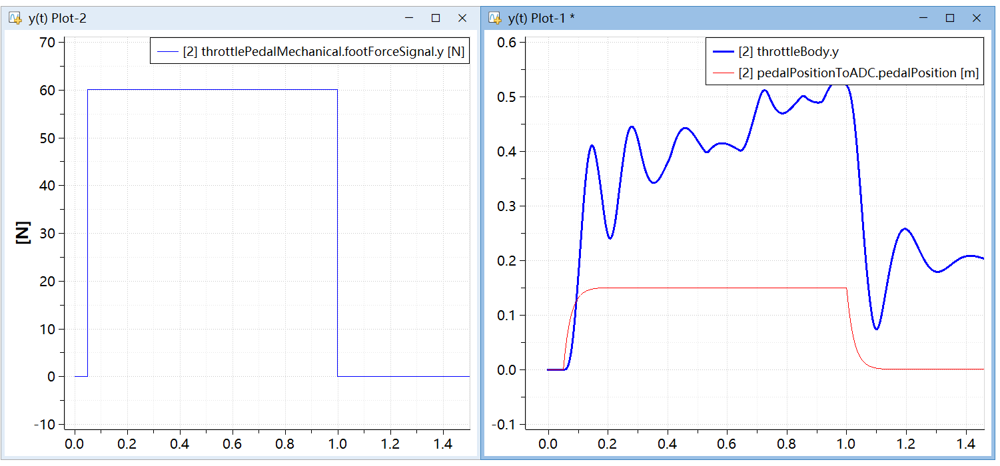

### 3. AUTOSAR_Physical_Interacction
- **Description**: This model, named AUTOSAR_Physical_Interaction, represents a typical closed-loop control system combining software control components with physical system dynamics. It comprises three parts: an AUTOSAR software component model (autosar_swc), a physical system model (PhysicalSystem), and their interconnection logic.

The PhysicalSystem model is a simplified second-order mechanical system with mass, damping, and spring elements. It receives two external control force inputs from the software components and applies Newton’s second law to compute acceleration as the net force divided by mass. The outputs are position and velocity signals fed back to the controller.

The software component model uses the autosar_swc_Example case.

At the top-level, the two subsystems form a closed-loop: physical displacement and velocity feed into the software component’s inputs, while the software outputs two control forces that act on the physical system. This implements a “sense–decide–act–feedback” closed-loop control logic.
- **Location**: `M2/Examples/AUTOSAR_Physical_Interacction`
- **Modelica**  

  Simulation results:  
  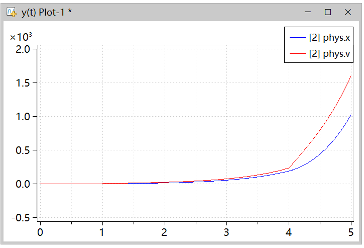

### 4. ContinousControl_Example
- **Description**:The ContinuousControl Modelica model simulates a controller-based rotational system, where multiple functional modules cooperate to achieve continuous control of the load's angular displacement. The reference trajectory is generated by the KinematicPTP2 block, which outputs a smooth desired angle trajectory (final value π radians) with specified velocity and acceleration limits, providing reference input to the control system.

The core control logic is implemented by swc_control1, reflecting the AUTOSAR software component (SWC) concept. In AUTOSAR, an SWC is a fundamental functional unit containing runnable entities triggered under specific conditions. This control SWC divides into fast and slow control parts internally, handling speed and angle feedback respectively, generating torque output signals for a dual-loop control strategy. This modeling approach simulates both control algorithm logic and AUTOSAR software architecture design.

The control torque output drives the rotational inertia (Inertia module), simulating the controlled load’s dynamic response. Speed and angle sensors provide real-time feedback to close the control loop.

The simulation uses the DASSL solver from 0 to 4 seconds with a step size accuracy of 1e-4 to ensure precise dynamic response capture.
- **Location**: `M2/Examples/ContinousControl_Example`
- **Modelica**  
  Model structure:  
  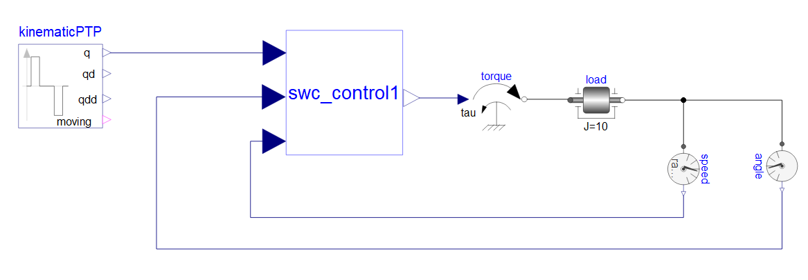  
  swc_control:
  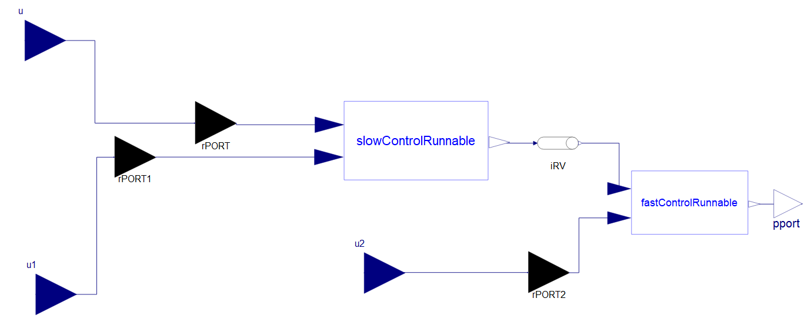 
  SlowControlRunnable:  
  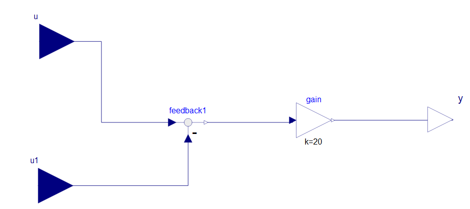  
  FastControlRunnable:  
  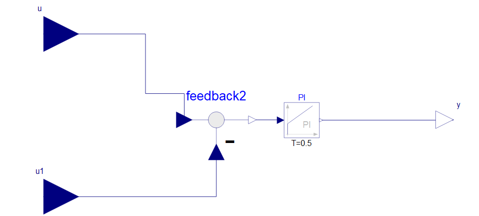  

  Simulation results:  
  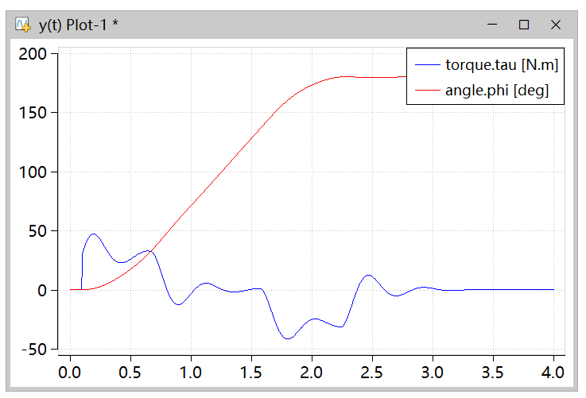

### 5. DriveSystemWithPID_Example
- **Description**: A simple drive system regulated by a PID controller, modeling a motor-load setup connected via an elastic coupling, with control logic encapsulated in an AUTOSAR application layer component. Key modules include reference trajectory generation, PI controller, motor inertia, load inertia, spring-damper, and sensors.

System composition and working principle:
The reference trajectory is generated by the Modelica.Blocks.Sources.KinematicPTP block, which sets the target angular position from rest at 0 seconds to a defined angle (driveAngle, default π/2) with specified acceleration and velocity after 0.5 seconds.

The controller is encapsulated within an AUTOSAR software component swc_model.swc, containing a Runnable_PID runnable entity composed of:

An integrator converting reference angle to desired velocity.

A PI controller implemented with Modelica.Blocks.Continuous.LimPID, supporting anti-windup and initial steady-state settings, outputting control torque.

Two input ports receiving reference angle and actual speed, with output torque through a PPORT.

Actuator and transmission:
The controller output torque drives the motor inertia (inertia1). The motor transmits motion to the load inertia (inertia2) through an elastic spring-damper connection. A constant load torque disturbance (10 Nm) is applied via loadTorque.

Sensor feedback:
A SpeedSensor measures motor-side angular velocity and feeds back to the PID controller for closed-loop control.

- **Location**: `M2/Examples/DriveSystemWithPID_Example`
- **Modelica**  
  
  Model structure:  
  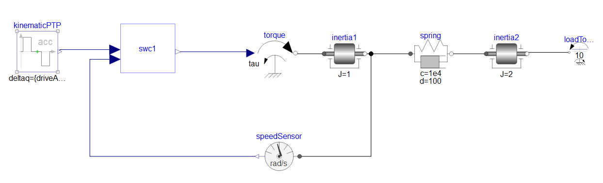  

 DriveSystemWithPID_swc:
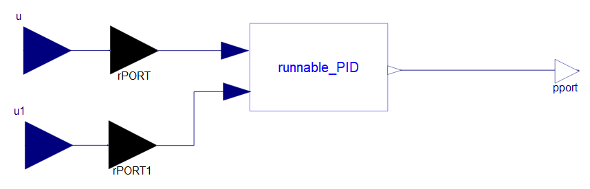  

Runnable_PID:
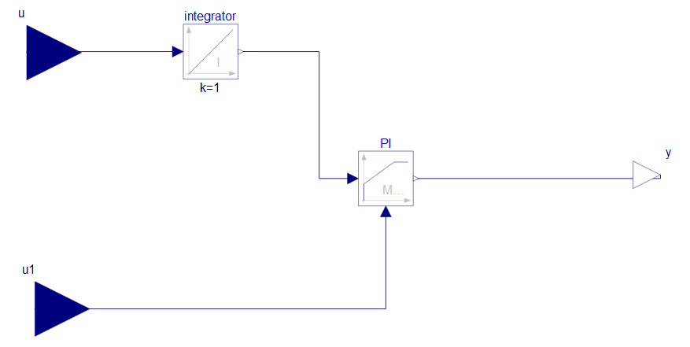 

  Simulation results:  
  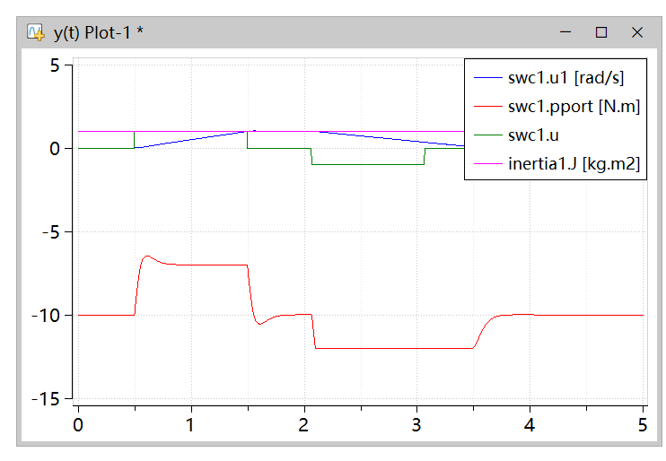

### 6. SpeedControllerDCPM_Example
- **Description**: A motor control system model built on the Modelica platform demonstrating the integration of AUTOSAR control architecture principles with multi-domain modeling methods for vehicle electric drive system modeling, simulation, and validation.

The model centers on a DC permanent magnet motor (DCPM) and its speed control system, integrating control software components with physical motor components.

Key components:

swc_controller1: AUTOSAR control software component, containing runnables for PI speed control, disturbance compensation, and PWM signal generation.

DCPMMotor: Physical motor component modeled as a multi-domain object with electrical, magnetic, and mechanical sub-models.

DCPMDrive: Model integrating motor, inverter, and control software components.

Simulation illustrates the closed-loop speed control from reference input to actual motor speed response.
- **Location**: `M2/Examples/SpeedControllerDCPM_Example`
- **Modelica**  
  Model structure:  
  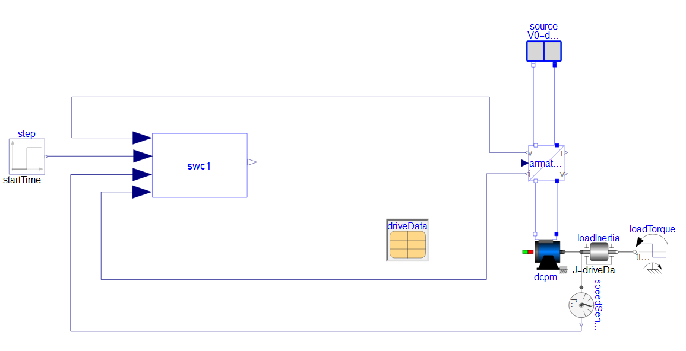  
  swc:
  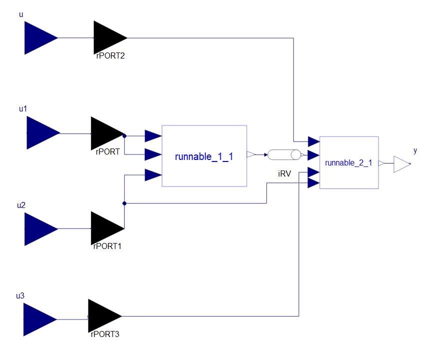
  Runnable1:
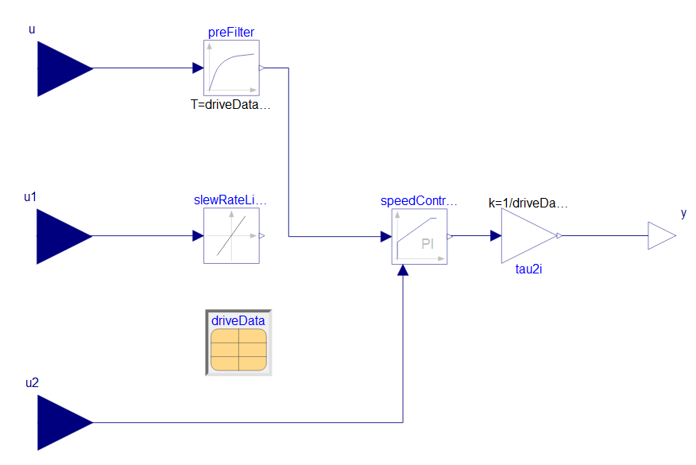 
  
  Runnable2:
   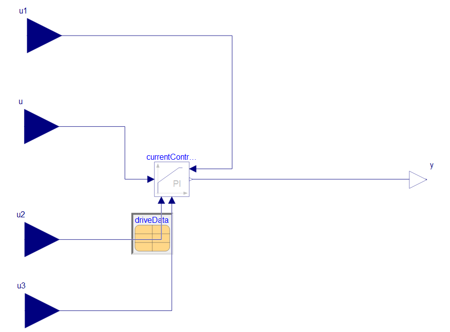 

  Simulation results:  
  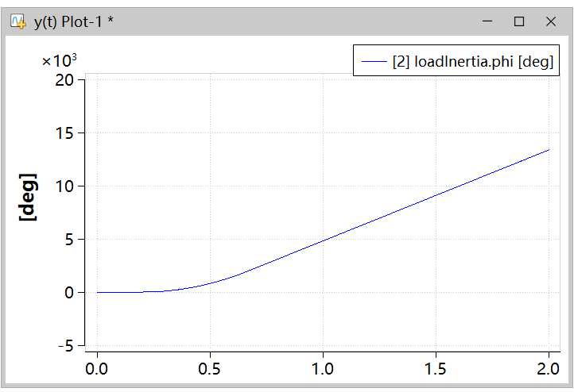

### 7. IMC_withLosses_Example

- **Description**:  
This model represents the electrical and mechanical characteristics of a three-phase asynchronous squirrel-cage induction motor. It not only captures the physical performance parameters of the motor but also emphasizes the controller part implemented as AUTOSAR-based software components (SWC).

The motor’s rated parameters such as rated power, rated voltage, current, power factor, efficiency, rated speed, and rated torque are defined. Measurement data tables are used to model and validate the motor’s current, power, speed, power factor, and efficiency characteristics.

The motor subsystem utilizes Modelica’s built-in squirrel-cage induction motor module (`IM_SquirrelCage`), parameterized with motor data including stator resistance, inductance, rotor parameters, mechanical inertia, and friction losses to accurately represent the motor’s electromechanical dynamic behavior.

On the electrical side, the model includes three-phase voltage sources, star connection, power and current sensors to simulate and measure the electrical input and output characteristics. The mechanical side consists of torque sources, inertia, and power sensors describing the mechanical load and speed response of the motor.

- **Location**: `M2/Examples/IMC_withLosses_Example`

- **Modelica**  
  Model structure:  
  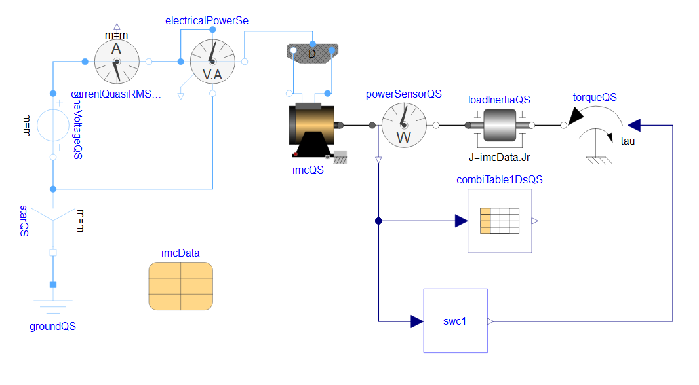  

  SWC:  
  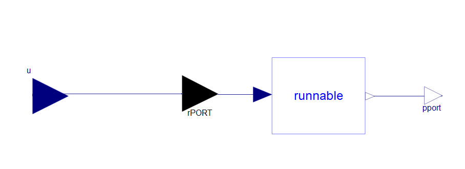  

  Runnable:  
  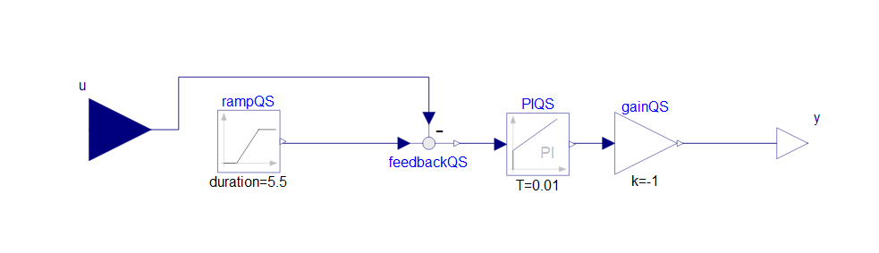  

  Simulation results:  
  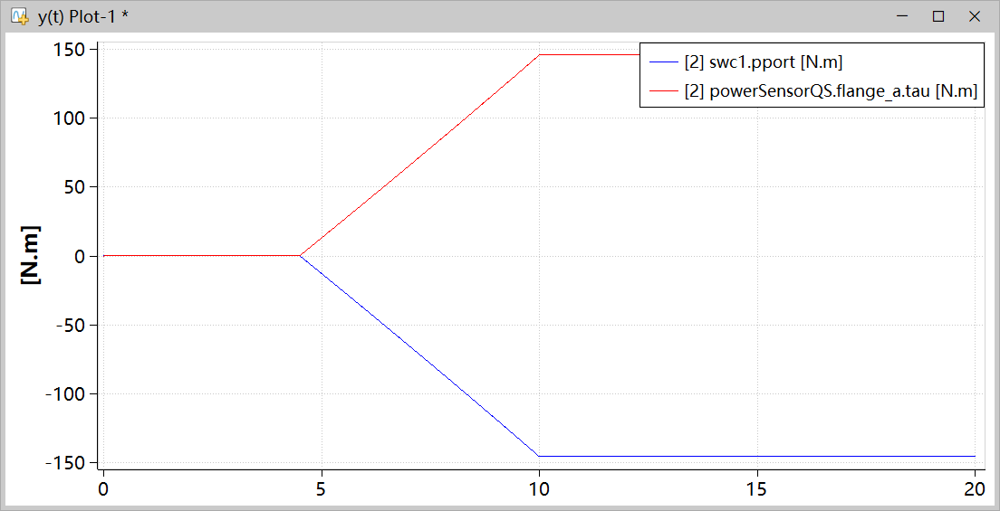

---

## About the Library Scope and Community Contribution

The AUTOSAR standard is extensive and continuously evolving. This library does **not** aim to cover the entirety of the AUTOSAR specification. Instead, it provides a **modular, fully extensible, and customizable** framework designed to serve as a foundation for further development.

✨ We warmly welcome developers, researchers, and practitioners from the AUTOSAR and Modelica communities to contribute, extend, and improve this library.  
Together, we can accelerate the growth of open-source tools supporting AUTOSAR, fostering innovation and collaboration across automotive and multi-domain system modeling.

If you are interested in contributing, please refer to the repository’s contribution guidelines or open an issue to start a discussion.  
Let’s build a vibrant ecosystem for open, flexible, and high-quality AUTOSAR modeling!
